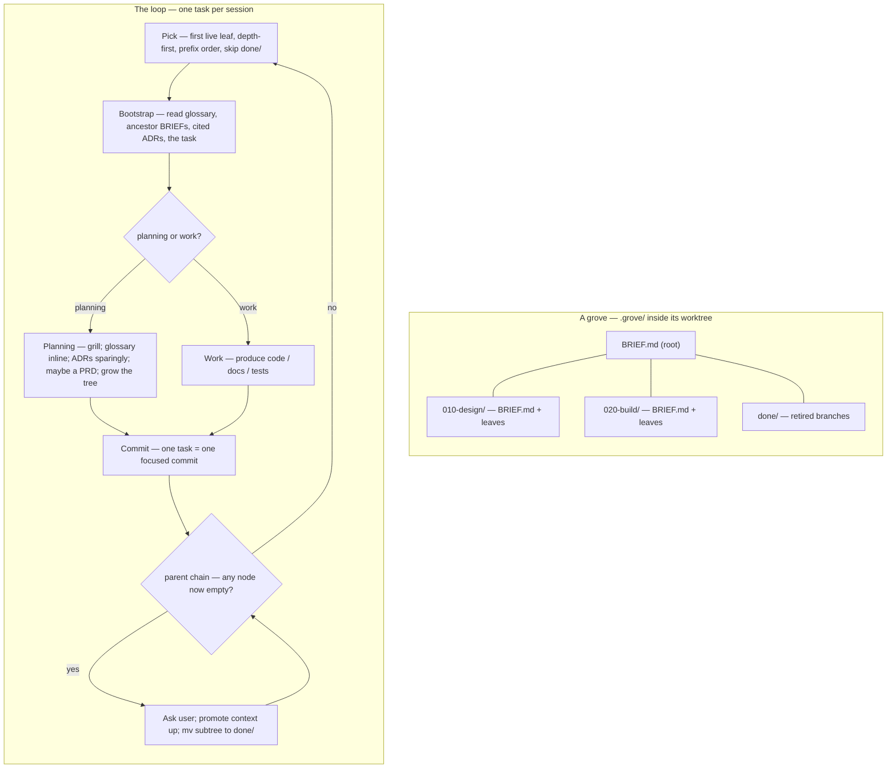

# grove — hierarchical, self-extending workstreams

A **grove** is one workstream driven as a git-tracked **tree of task files**,
one task per session. Planning tasks grow the tree as understanding deepens;
completed branches retire to an archive. The tree's shape — what `ls` shows —
is the only state; git is the history.

## The spine — seven constraints

grove drives long work *without* becoming brittle, constraining machinery.
These seven rules are non-negotiable; everything below is subordinate to them.

1. **Artifacts, not state.** No phase file, no session log, no status file.
   What `ls` shows is the only state; git is the history.
2. **Read, don't run.** A session bootstraps by *reading markdown* — no script
   must succeed before work begins. (Materialising or updating grove itself is
   a separate maintenance action and may use a script — see `VERSION.md`.)
3. **Suggested shape, not enforced schema.** Task files and briefs are freeform
   markdown. The format files are guides; nothing validates them.
4. **Lazy and optional.** Every artifact — brief, ADR, PRD, glossary entry — is
   created only when it earns its place, never because a step demands it.
5. **grove guides, it does not gate.** grove never refuses to proceed. A task
   may be done by hand, reordered, or skipped.
6. **Walk-away-able.** Delete this skill and `.grove/` is still a legible
   folder of notes; every durable output is standard, team-readable markdown.
7. **One page of rules.** If the loop below does not fit on a page, it is too
   complex — cut until it does.

## The loop

One task is one session. All sessions of one grove run in the **same git worktree** at `<repo>/.grove-worktrees/<name>/` on branch `<name>` — new worktrees are for separating *concurrent groves*, not for separating tasks within a grove. The grove's task tree lives at `.grove/` inside that worktree.

Sessions are launched by the `grove` CLI (installed via `brew install Linkuistics/taps/grove`): `grove start <name>` for a new grove (creates the worktree, branches off the default branch, opens a bootstrap session) and `grove continue <name>` to resume. Both pre-name the harness session, so the rename ritual is unnecessary in the common case.

If a session was started without the helpers and the session name doesn't already match `<repo>: <name> grove`, suggest `/rename <repo-basename>: <name> grove` once per session and move on. The skill already knows both names: `<name>` from the worktree's branch (`git rev-parse --abbrev-ref HEAD`), `<repo-basename>` from `git rev-parse --show-toplevel`'s parent (the worktree's path is `<repo>/.grove-worktrees/<name>/`).

**Pick.** Run `grove-llm pick` — it walks `.grove/` depth-first in
numeric-prefix order, skipping `done/`, and prints the absolute path of the
next live `.md` leaf. Empty stdout (and a diagnostic on stderr) means the
grove has no live leaves and is ready to **Finish**. The walk's *semantics*
(depth-first, numeric prefix, skip `done/`, `BRIEF.md` is not a leaf) are
what the verb implements; reach for them only when reasoning about the walk,
not when running it.

**Bootstrap.** Read, in order: the glossary (`CONTEXT.md`, or the relevant
bounded context via `CONTEXT-MAP.md`); the ADRs cited by the briefs; the
`BRIEF.md` chain root→leaf, enumerated by `grove-llm brief-chain` — the verb
walks ancestors of the picked leaf up to the grove root and prints one
absolute `BRIEF.md` path per line, root→leaf (a missing `BRIEF.md` at any
level is skipped silently — some nodes do not yet carry a brief); the task
file. Then **drain the inbox** by
running `grove-llm inbox-drain --for=<name>` — this fetches the latest state
(when a remote is configured) and prints one absolute path per pending
observation. Read each, triage as **incorporate** (use it in this task),
**defer** (write a follow-up leaf, or re-capture to another grove via
`grove-llm inbox-add --to=<other-name>`), or **reject** (out of scope).
Finalize with `grove-llm inbox-drain --for=<name>
--incorporated=<path>... --deferred=<path>... --rejected=<path>...`: the CLI deletes the triaged
files in one commit named with the disposition counts and pushes when
configured. Drain runs at every `grove start` and `grove continue`; the
LLM never touches the inbox branch directly. That assembled context —
read material plus drained inbox — is the session's entire mandate; read
nothing else by reflex.

**Execute.** The task file states its kind (`TASK-FORMAT.md`):
- A **work task** produces code, docs, or tests.
- A **planning task** opens with a **grilling session** (`grilling.md`):
  interview the user one question at a time, propose a recommended answer for
  each, walk down the design tree until shared understanding is reached.
  Through that grilling, update `CONTEXT.md` *inline* as terms resolve, raise
  ADRs *sparingly* (`ADR-FORMAT.md`), MAY write a PRD at a genuine agreement
  point, and **grow the tree**. See `driving.md` for the field-guide habits
  that make grilling and research-leaf commissioning productive (WDYT,
  pushback, running decision log, citation discipline).

**Decompose.** When a leaf is too big for one focused session, a planning task
replaces the leaf `NNN-x.md` with a node `NNN-x/` holding a `BRIEF.md`
(`BRIEF-FORMAT.md`) and ordered child leaves — lazily, only when needed.
Convert the leaf into a node by running `grove-llm leaf-decompose <leaf-path>`:
the verb `git mv`s `NNN-x.md` into `NNN-x/BRIEF.md` and retitles the first-line
`# NNN-x` header to `# NNN-x — brief`. Reshape the brief body afterwards if
needed (that part is judgement; the verb only does the mechanical move). Then
grow the node by running `grove-llm leaf-add <slug>` to append a new leaf at
the next free three-digit prefix (the common case), or `grove-llm leaf-insert
<prefix>-<slug>` when a new concern surfaces that must sequence ahead of
existing leaves — the insert verb shifts every sibling at or after that prefix
up by 10, `git mv`s the affected files and directories, rewrites their
`# NNN-...` first-line headers, and surfaces any numeric cross-references on
stderr for the operator to review (the verb does not auto-rewrite — references
may be intentional historical pointers). All three verbs are working-tree
changes only; the enclosing task's commit folds them in.

**Commit.** One task = one focused commit.

**Retire.** After committing the task, retire the just-finished leaf by
running `grove-llm leaf-retire <leaf-path>` — the verb `git mv`s the leaf into
`.grove/done/`, preserving its relative path inside `.grove/`. Mechanical
bookkeeping, no need to ask. Then walk the parent chain: if a node now has no
live leaves left, **ask the user before retiring it** — the confirmation gives
them a moment to add a follow-up leaf if the node is not actually done. On
confirmation, promote anything still relevant from the node's `BRIEF.md`
upward — to the parent brief, an ADR, or the glossary — then `git mv` the
whole node into `.grove/done/`, preserving its path. That retirement may empty
the next ancestor; re-check, ask again, recurse, until a node still has live
leaves or you reach the grove root. Archived in-grove, never deleted while the
grove is live. The cascade walk and the brief-promotion-upward stay prose
deliberately: both are judgement steps (does this node retire? what survives
upward?) with no stable input/output shape that would justify a verb.

**Finish.** When the whole grove is done — every leaf retired into `done/` —
promote anything from the briefs that should outlive the grove (ADRs, docs,
glossary entries), then **delete `.grove/` in one focused commit** before
merging the branch to the default branch. The default branch never carries
any grove's local state; its history of completed groves lives in git's
commit graph, not in retained directories.

## Artifacts

Only the task tree is grove-specific and ephemeral. Everything else is a
standard artifact that outlives grove (constraint 6).

| Artifact | Path | Role |
|---|---|---|
| Glossary | `CONTEXT.md` (+ `CONTEXT-MAP.md`) | the Ubiquitous Language — read every session, appended inline |
| ADRs | `docs/adr/NNNN-*.md` | atomic decisions: hard to reverse, surprising, or a real trade-off |
| PRDs | `docs/prd/` | human-facing agreement checkpoints; committed, never retired |
| Design specs | `docs/specs/*-design.md` | workstream-level technical design |
| Task tree | `.grove/` (inside the grove's worktree) | the process: the self-extending decomposition of work; deleted at `grove finish` before merging |
| `grove-meta` branch | `<repo>/.grove-meta/inboxes/<name>/<entry>.md` | cross-grove inbox files; capture observations to another grove via `grove-llm inbox-add --to=<name>`, drained on every bootstrap (ADRs `0002-grove-meta-branch-and-inbox-model.md`, `0003-cross-repo-inbox-handoff.md`, `0004-inbox-as-directory-of-observation-files.md`, `0005-grove-meta-sync-semantics.md`, `0006-grove-llm-binary-separation.md`). Materialised by `grove install` / `grove update`; for repos that pre-date the feature, or whose worktree was removed, run `grove meta init`. |

**The glossary is load-bearing.** The acute failure mode of multi-session work
is terminology drift: a later session, with no memory of an earlier one,
reinvents its term under a new name or reuses the words with a shifted meaning.
`CONTEXT.md`, read every session and appended *inline* whenever a term is
resolved, is the forcing function against that. Keep it a glossary and nothing
else — terse definitions, aliases-to-avoid, no implementation detail
(`CONTEXT-FORMAT.md`).

**Briefs vs. the glossary.** A bounded context is a *domain* partition; a
task-tree node is a *process* partition. They are orthogonal axes. The glossary
is per-bounded-context; a node carries a `BRIEF.md`, not a glossary.

**Inboxes and capture.** When during any task you notice an observation
belonging to a *different* grove — future, currently running, or already
finished — capture it via `grove-llm inbox-add --to=<name> --body=...`
(or `--body-file=` / `--body-stdin`) and keep going. Same-repo and
cross-repo writes use the same gesture; the LLM never edits the
`grove-meta` branch directly. `grove-llm` is the LLM-driven sibling
binary that ships alongside `grove` (ADR-0006); the human `grove`
binary still exposes `grove inbox show <name>` as a diagnostic. The
grove project's own repo carries a worked example: its `CONTEXT.md`
records the canonical `Inbox`, `Seed`, `Drain`, and `grove-meta branch`
entries that any repo adopting the convention should copy or paraphrase
into its own glossary.

## PRDs

A **PRD** is the human-facing, team-shareable face of a planning increment,
produced lazily by a planning task *when the increment is a genuine agreement
point*. The flow there: grill → PRD (review & agree) → decompose → execute.
PRDs live in `docs/prd/`, are committed, and are never retired.

## Reference files

- `BRIEF-FORMAT.md` — the `BRIEF.md` shape.
- `TASK-FORMAT.md` — the task-file shape and the two task kinds.
- `CONTEXT-FORMAT.md` — the glossary format (bundled from `mattpocock/skills`).
- `ADR-FORMAT.md` — the ADR format (bundled from `mattpocock/skills`).
- `grilling.md` — the grilling procedure for planning tasks (bundled).
- `driving.md` — field guide for driving grove sessions well: when to commission prior-art research, how to write a research-leaf brief, grilling moves (WDYT, pushback, running log), and when research findings retire into ADRs.
- `prompts/` — the launcher prompts read by the `grove` CLI at exec time (`start.md`, `continue.md`, `takeover.md`, `retire.md`, `finish.md`).
- `VERSION.md` — which grove version this is and how to update it (present only
  in a materialised copy; written by the materialise script).
